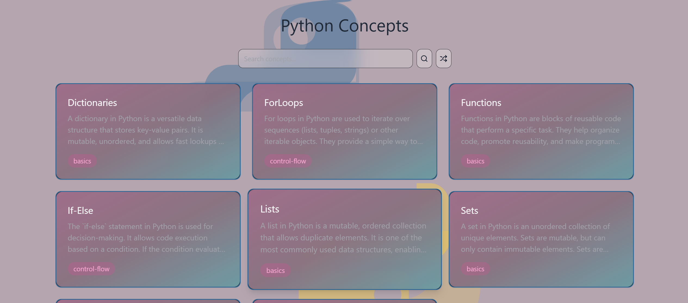
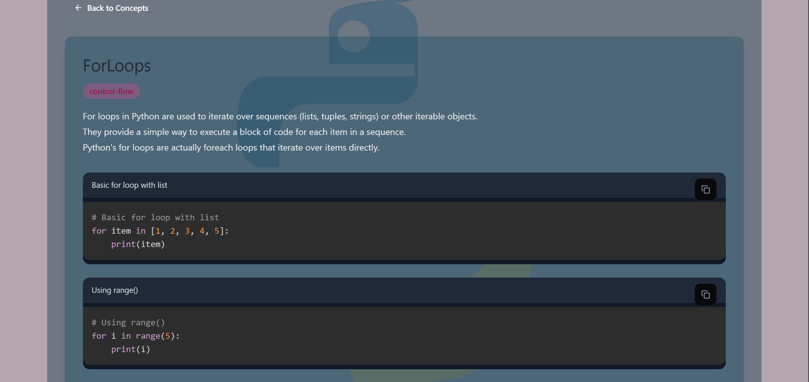
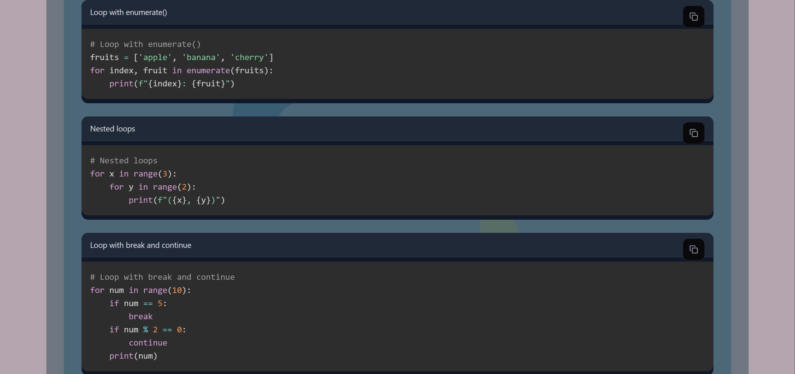

# Python Concepts

A simple project for browsing Python concepts, explanations, and example code.

---


---

## Overview

Python Concepts is a small concept browser containing Python explanations and code examples.

The project includes:

- Searchable concepts
- Categorized topics
- Example snippets
- Copyable code blocks
- Simple navigation

All concept data is stored inside the `concepts/` directory.

---

<details>
<summary><b>Preview</b></summary>

<br>

### Main Browser


---

### Concept View



---

### Example Sections



</details>

---

<details>
<summary><b>Features</b></summary>

<br>

- Concept search
- Topic categories
- Code examples
- Copy buttons
- Responsive layout
- Expandable concept pages

</details>

---

<details>
<summary><b>Project Structure</b></summary>

<br>

Concepts are loaded from the `concepts/` folder.

Each concept contains:

- Title
- Description
- Tags
- Examples
- Additional notes

Adding new concepts is straightforward : Just add new files.

</details>

---

<details>
<summary><b>Installation</b></summary>

<br>

### Install dependencies

```bash
npm install
```

### Build project

```bash
npm run build
```

### Start development server

```bash
npm run dev
```

Open:

```txt
http://localhost:5000
```

Run commands from the root directory.

</details>

---

<details>
<summary><b>Tech Stack</b></summary>

<br>

- JavaScript
- Node.js
- HTML/CSS

</details>

---

## License

MIT License

---
